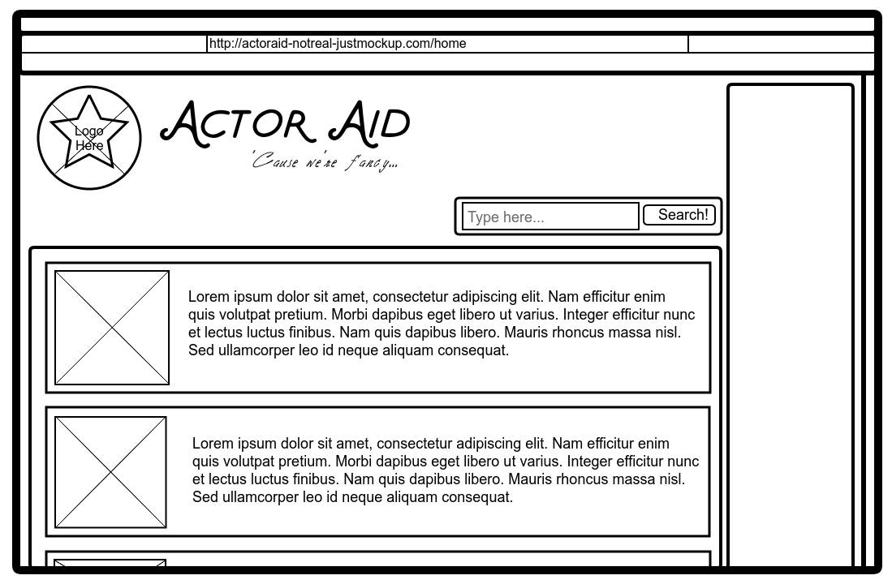

<br>
<p align="center">
  <u><big>|| <b>Capstone Expectations Project: ActorAid</b> ||</big></u>
</p>
<p align="center">
    <!-- Project Avatar/Logo -->
    <br>
    <a href="#">
        
    </a>
    <p align="center">
      ___________________________
    </p>
    <!-- GitHub Link -->
    <p align="center">
        <a href="#">
            <strong>TotallyNot-LondresRi</strong>
        </a>
    </p>
    <!-- Project Shields -->
    <p align="center">
        <a href="#/Capstone-Prep-Expectation/graphs/contributors">
            
        </a>
        ¨
        <a href="#/Capstone-Prep-Expectation/stargazers">
            
        </a>
        ¨
        <a href="#/Capstone-Prep-Expectation/issues">
            
        </a>
        ¨
        <a href="#/Best-README-Template/blob/master/LICENSE.txt">
            
        </a>
        ¨
        <a href="https://linkedin.com/in/lunsfordsk">
            
        </a>
    </p>    
</p>

<p align="center">
  <small>Initiated May 6th 2020</small>
</p>

<!-- Project Links -->
<p align="center">
    <a href="#/Capstone-Prep-Expectation"><big>Project Docs</big></a> ·
    <a href="#/Capstone-Prep-Expectation/issues"><big>Report Bug</big></a> ·
    <a href="#/Capstone-Prep-Expectation/issues"><big>Request Feature</big></a>
</p>

------------------------------

### <u>Table of Contents</u>
* About the Project
    * Description
    * Known Bugs
    * Built With
* Scope
    * Minimal-Viable Product
    * Product Roadmap
    * Specs
    * Wireframe
* Getting Started
    * Prerequisites
    * Installation
    * Use
* Auxiliary
    * Technology
    * Contributors
    * Contact
    * License
    * Acknowledgements

------------------------------

## 🌐 About the Project

### 📖 Description
ActorAid is a time management mobile app that coordinates a user’s schedule to maximize casting audition opportunities.

### 🦠 Known Bugs

* No known bugs.

### 🛠 Built With
* [Mac OS X El Capitan 10.11.6](https://en.wikipedia.org/wiki/MacOS_Mojave)
* [Visual Studio Code](https://code.visualstudio.com/)
* [Markdown](https://daringfireball.net/projects/markdown/)

------------------------------

## 🔭 Scope

### Use Case
<details>
<summary>Expand Use Case</summary>
Users are primarily actors who are struggling with time management. The difficulty of managing shifts at their main-income jobs and time slots for auditions has led to increased stress which affects their capabilities, leading to missed opportunities.

The product will systemize calendars across platforms and apps for viewing regular work hours, a two-click feature for manually adding irregular work hours, creating reminders, and adding alerts for local events such as workshops or new auditions. Time slot conflicts between work hours and events will be alerted to the user so that the conflict can be resolved.

The product will offer line delivery prompts for practice sessions that users can record and save to compare at a later time. The product will store practice times in a chart so that users can see their progress and manage their practice time as they see fit.

The product will prompt the user to input a stress rating twice daily and store their inputs into a chart for users to view their stress levels over time, so that they may better manage it.

The product will offer daily meditation prompts, ranging from 2 to 20 minutes, urging the user to consider their self-care and manage their stress levels. The product will store meditation times in a chart for users to view.

The product will allow users to mitigate their stress by giving them a tool that helps manage their time use and alerts them to the opportunities they are interested in pursuing.
</details>

### Minimum-Viable Product (To Be Completed)
 * User registration (database storage)
 * User login/sign-out (with database authentication)
 * Calendar with month and day views (one-click switch)
 * Capability to add regular work hours to calendar (repeated event)
 * Capability to add irregular work shifts to calendar (one time events)
 * Capability to search for local events (default search: any event containing ‘audition’ in their title or description)
 * Capability to add events to the calendar

### Future Product Roadmap
* Time slot conflict alert (when an event conflicts with another event or a work hour)
 * Time slot conflict resolution modal (prompt to remove event or ‘snooze’ until work hour can be taken off)
 * Reminders for calendar events (any non-work hour items on the calendar)
 * Option for reminders for all calendar events (including work hour items)
 * Capability to search for local events, with customized search, to add to calendar (user is able to search for what they are looking for such as workshops, auditions, networking events, etc)
 * Daily (optional) prompts for line delivery practice.
 * Capability to snooze daily practice prompts.
 * Daily (optional) meditation prompts.
 * Capability to snooze daily meditation prompts.
 * Capability to set specific times for practice and meditation prompts.
 * Daily (non-optional) prompts for stress level reporting.
 * Add condition that stress prompts must be at least 8 hours apart, and do not accumulate, and depends on when user signs in.
 * Create a chart of recorded stress prompt answers for the user to view.
 * Create a chart for completed practice prompts in a day for the user to view.
 * Create a chart for completed meditation prompts for the user to view.
 * Allow user to access practice prompts besides the daily prompt
 * Modify practice chart to count the number of completed practice prompts
 * Capability to record and listen to the audio of practice for the user to save in their profile
 * Capability for the user to rate their practice audios
 * Create a chart of user ratings of practice audio for the user to view.
 * User registration (database storage, Facebook credentials, Google credentials)
 * User authentication (database, Facebook, Google)


### Specs

<details>
  <summary>User stories and specifications</summary>
  <table>
    <tr>
      <th> Story 01 </th><th></th>
    </tr>
    <tr>
      <td> User Story </td>
      <td>As a senior theatre-major college student, I want to be able to search for casting events by time slots, so that I am able to plan around my school and work schedules.</td>
    </tr>
    <tr>
      <td> Behavior 01-A </td>
      <td>User is able to filter through casting call API data by time of day.</td>
    </tr>
    <tr>
      <td> Input </td>
      <td>"Evening"</td>
    </tr>
    <tr>
      <td> Output </td>
      <td>API data with event times at 6PM to 10PM</td>
    </tr>
    <tr>
      <td> Notes </td>
      <td>API data will be called prior to filter options, and will not require a second API call.</td>
    </tr>
    <tr>
      <td> Completion </td>
      <td>False</td>
    </tr>
  </table>

  <hr><hr>

  <table>
    <tr>
      <th> Story 02 </th><th></th>
    </tr>
    <tr>
      <td> User Story </td>
      <td>As a self-conscious voice actor, I want to be able to record and playback my practice lines, so that I can have record of my objective improvement.</td>
    </tr>
    <tr>
      <td> Behavior 02-A </td>
      <td>User is able to record their voice and have it stored locally.</td>
    </tr>
    <tr>
      <td> Input </td>
      <td>Audio recording</td>
    </tr>
    <tr>
      <td> Output </td>
      <td>Store local data of mp4 on device</td>
    </tr>
    <tr>
      <td> Notes </td>
      <td>Research storing audio data on server database for cross-platform access.</td>
    </tr>
    <tr>
      <td> Completion </td>
      <td>False</td>
    </tr>
    <tr>
      <td> Behavior 02-B </td>
      <td>User is able to playback locally stored audio.</td>
    </tr>
    <tr>
      <td> Input </td>
      <td>Locally stored mp4 on device</td>
    </tr>
    <tr>
      <td> Output </td>
      <td>Audio of selected mp4</td>
    </tr>
    <tr>
      <td> Notes </td>
      <td>Research sorting options for stored mp4 files for ease of finding.</td>
    </tr>
    <tr>
      <td> Completion </td>
      <td>False</td>
    </tr>
  </table>
</details>

### 🎨 TotallyRealWireframe


------------------------------

## ⚙ Setup and Use

### Prerequisites
* Understanding of Markdown and HTML languages
* Option 1: [Atom](https://nodejs.org/en/)
* Option 2: [VisualStudioCode](https://www.npmjs.com/)
* [GitHub Account](https://github.com) (Optional)

### Installation
1. Navigate to [Capstone-Prep-Expectation repository](#)
2. Clone the repository: 
`$ git clone #/Capstone-Prep-Expectation.git`

### Use
* Use preferred IDE or Text Editor to review documentation

------------------------------

## 🖥️ Technology

### MVP
* VisualStudio Code
* React Native SDK
* Nuclide Atom Addition
* RealM Database
* Eventbrite Platform API
* ESLint, AirBnB settings
* Jest Testing Framework

### Planned
* Calendar syncing (Google API?)
* React Native Timer Module
* MeetUp API
* Backstage.com Casting RSS Feed
* ProductionHub.com Casting Notices Alerts
* React Native Audio Player Recorder Package
* React Chartkick
* Facebook Authentication
* Google Authentication

------------------------------

## 🤝 Contributors

| Author | GitHub | Email |
|--------|:------:|:-----:|
| [Amber Doe Jr.](#) | [TotallyNot-LondresRi](#) |  [amber@fakeemail.com](#) |

------------------------------

## ✉️ Contact and Support

If you have any feedback or concerns, please contact one of the contributors.

<p align="center">
    <a href="#/Capstone-Prep-Expectation/issues">Report Bug</a> ·
    <a href="#/Capstone-Prep-Expectation/issues">Request Feature</a>
</p>

------------------------------

## ⚖ License

This project is licensed under the [MIT License](https://opensource.org/licenses/MIT). Copyright (c) 2020 Amber Doe Jr. All Rights Reserved.
```
MIT License

Copyright (c) 2020 Amber Doe Jr.

Permission is hereby granted, free of charge, to any person obtaining a copy
of this software and associated documentation files (the "Software"), to deal
in the Software without restriction, including without limitation the rights
to use, copy, modify, merge, publish, distribute, sublicense, and/or sell
copies of the Software, and to permit persons to whom the Software is
furnished to do so, subject to the following conditions:

The above copyright notice and this permission notice shall be included in all
copies or substantial portions of the Software.

THE SOFTWARE IS PROVIDED "AS IS", WITHOUT WARRANTY OF ANY KIND, EXPRESS OR
IMPLIED, INCLUDING BUT NOT LIMITED TO THE WARRANTIES OF MERCHANTABILITY,
FITNESS FOR A PARTICULAR PURPOSE AND NONINFRINGEMENT. IN NO EVENT SHALL THE
AUTHORS OR COPYRIGHT HOLDERS BE LIABLE FOR ANY CLAIM, DAMAGES OR OTHER
LIABILITY, WHETHER IN AN ACTION OF CONTRACT, TORT OR OTHERWISE, ARISING FROM,
OUT OF OR IN CONNECTION WITH THE SOFTWARE OR THE USE OR OTHER DEALINGS IN THE
SOFTWARE.
```

------------------------------

## 🌟 Acknowledgments

#### [Actors-R-Thee](#)
>"A group of passionate actors that express themselves on the global stage."

